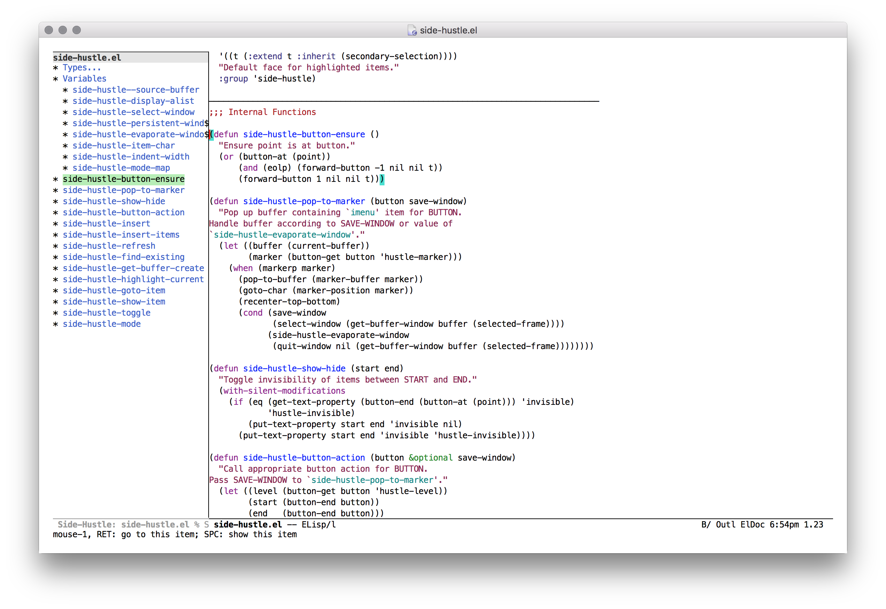

Side Hustle
===========

[][1]
[][2]

Hustle through a buffer's Imenu in a side window in GNU Emacs.

Side Hustle spawns a side window linked to the current buffer, which allows
working with multiple buffers simultaneously.

See <https://www.gnu.org/software/emacs/manual/html_node/emacs/Imenu.html>.

Installation
------------

The latest stable release of Side Hustle is available via [MELPA-stable][1].
First, add MELPA-stable to your package archives:

    M-x customize-option RET package-archives RET
    
Insert an entry named `melpa-stable` with URL:
`https://stable.melpa.org/packages/`

You can then find the latest stable version of `side-hustle` in the list
returned by:

    M-x list-packages RET

If you prefer the latest but perhaps unstable version, do the above using
[MELPA][2].

Then add a key binding to your init file:

    (define-key (current-global-map) (kbd "M-s l") #'side-hustle-toggle)

Bugs and Feature Requests
-------------------------

Send me an email (address in the package header). For bugs, please
ensure you can reproduce with:

    $ emacs -Q -l side-hustle.el

Known issues are tracked with `FIXME` comments in the source.

Alternatives
------------

Side Hustle takes inspiration primarily from
[imenu-list](https://github.com/bmag/imenu-list).

[1]: https://stable.melpa.org/#/side-hustle
[2]: https://melpa.org/#/side-hustle
